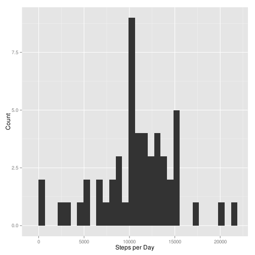
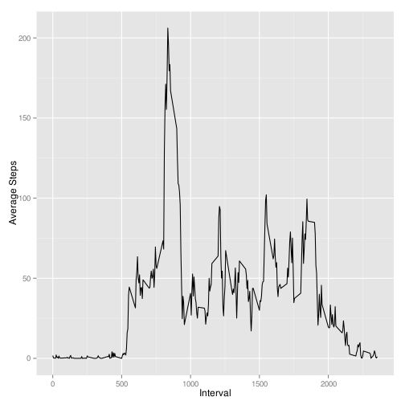

# Reproducible Research: Peer Assessment 1

This document reports the results of a cursory analysis of data obtained from a personal activity monitoring device such as a FitBit, Nike FuelBand, or JawBone Up. The data proviced for the analysis is comprised of activity monitor readings taken at 5 minute intervals through out the day. The data consists of two months of data from an anonymous individual collected during the months of October and November, 2012 and include the number of steps taken in 5 minute intervals each day.   

Steps to process and analyse the data are documented in the sections below.

## Loading and preprocessing the data

The raw dataset was provided in comma-seperated value (CSV) format. The data is comprised of three variables:

- the *date* the reading was taken;
- the 5-minute *interval* within the date when the reading was taken; and
- the number of *steps* the monitor recorded in the interval.  

Intervals where there was no reading taken, e.g. the wearer was not wearing the device, are indicated by the value "NA" in the *steps* column.

Data was loaded and the variables transformed to appropriate R classes using the following R code:


```r
library(data.table)

activity <- read.csv("activity.csv", header=TRUE, colClasses=c("numeric", "character", "numeric"))
activity$date <- as.POSIXct(activity$date, format="%Y-%m-%d")
activity <- as.data.table(activity)
```

## What is mean total number of steps taken per day?

The initial step in the analysis was to calculate the total steps taken per day; days with no data available were removed from the results. The results of the analysis are presented in the histogram below.


```r
library(ggplot2)

stepsPerDay <- activity[ , lapply(.SD, sum), by=date]
stepsPerDay <- stepsPerDay[!is.na(stepsPerDay$steps), ]

ggplot(stepsPerDay, aes(steps)) + 
  geom_histogram(binwidth = max(stepsPerDay$steps) / 30) +
  xlab("Steps per Day") +
  ylab("Count")
```

 

The mean total steps per day for the data is:


```r
rawMean <- mean(stepsPerDay$steps)
rawMean
```

```
## [1] 10766
```

The median of the total steps per day for the data is:


```r
rawMedian <- median(stepsPerDay$steps)
rawMedian
```

```
## [1] 10765
```

## What is the average daily activity pattern?

To further examine daily activity patterns I plotted the average steps taken for each 5-minute measurement interval across all days.


```r
stepsPerInterval <- activity[ , lapply(.SD, mean, na.rm=TRUE), by=interval]

ggplot(stepsPerInterval, aes(interval, steps)) + 
  geom_line() +
  xlab("Interval") +
  ylab("Average Steps")
```

 

From this data we easily see which 5-minute interval has, on average, the highest number of steps in a day.


```r
interval <- stepsPerInterval$interval[stepsPerInterval$steps == max(stepsPerInterval$steps)]
hourOfDay <- trunc(interval / 60)
minuteOfHour <- 60 * ((interval / 60) - hourOfDay)
intervalText <- paste("Interval -->", interval)
paste(intervalText, " (Time: ", hourOfDay, ":", minuteOfHour, ")", sep="")
```

```
## [1] "Interval --> 835 (Time: 13:55)"
```

## Imputing missing values

A number of rows in the dataset did not have a step count available during the interval. This likely occurs when the user is charging the activity monitor or otherwise not wearing the device. The following shows the number of rows without step readings:


```r
sum(!complete.cases(activity))
```

```
## [1] 2304
```

To avoid introducing bias into the analysis by discarding the incomplete rows I used the average steps for the interval in place of the unavailable data. This was done using the R code below.


```r
incomplete <- activity[!complete.cases(activity), ]

for (i in 1:nrow(incomplete)) {
  incomplete$steps[i] <- stepsPerInterval$steps[stepsPerInterval$interval == incomplete$interval[i]]
}

completeData <- rbind(incomplete, activity[complete.cases(activity), ])
```

After imputing the mising values I re-built the histogram of total steps per day, the mean steps per day, and the median steps per day. The histogram is shown below.


```r
newStepsPerDay <- completeData[ , sum(steps), by=date]
setnames(newStepsPerDay, "V1", "steps")

ggplot(newStepsPerDay, aes(steps)) + 
  geom_histogram(binwidth = max(newStepsPerDay$steps) / 30) +
  xlab("Steps per Day") +
  ylab("Count")
```

 

The mean total steps per day with the imputed data included is:


```r
completeMean <- mean(newStepsPerDay$steps)
completeMean
```

```
## [1] 10766
```

The median of the total steps per day with the imputed data included is:


```r
completeMedian <- median(newStepsPerDay$steps)
completeMedian
```

```
## [1] 10766
```

### What is the impact of imputing missing data?

Imputing missing step values impacted the analysis results by shifting the sample mean by 0 and the sample median by -1.1887.

## Are there differences in activity patterns between weekdays and weekends?

To examine the difference in activity patterns between weekday and weekends I augmented the dataset to include an indicator of whether a date was a weekday or weekend. This was done using the R code below.


```r
weekendMask <- weekdays(completeData$date) %in% c("Saturday", "Sunday")
completeData$dayType <- "weekday"
completeData[weekendMask, ]$dayType <- "weekend"
completeData$dayType <- as.factor(completeData$dayType)
```

Using this augmented data I was able to generate plots to compare activity patterns between weekends and weekdays.


```r
library(lattice)

daySteps <- completeData[ , mean(steps), by=c("interval", "dayType")]
setnames(daySteps, "V1", "steps")

xyplot(daySteps$steps~daySteps$interval|daySteps$dayType, 
       type="l", 
       layout=c(1,2), 
       xlab="Interval", 
       ylab="Average Steps")
```

 
